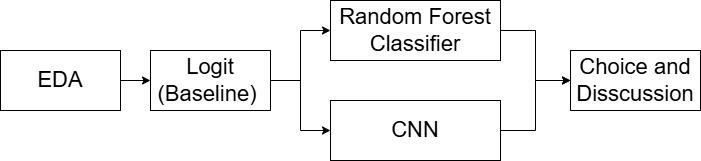
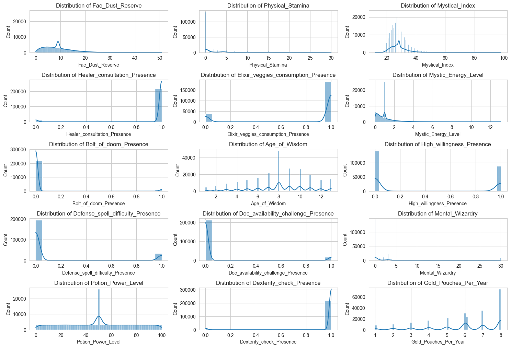
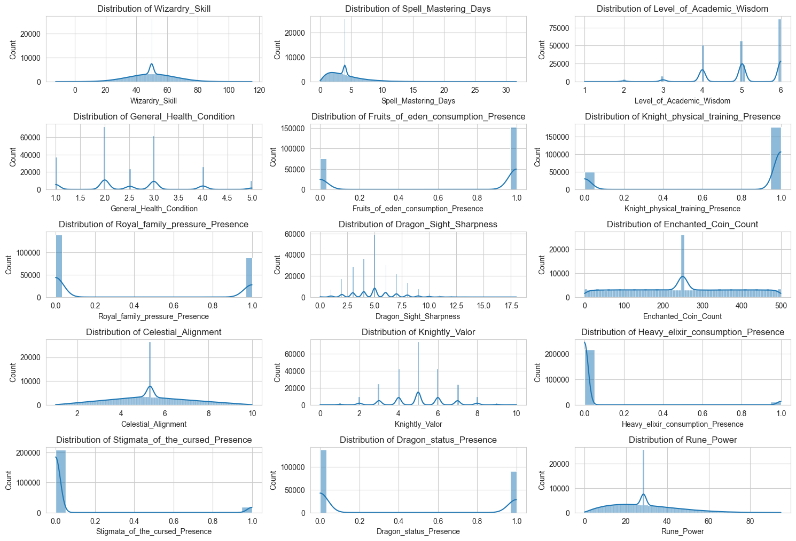
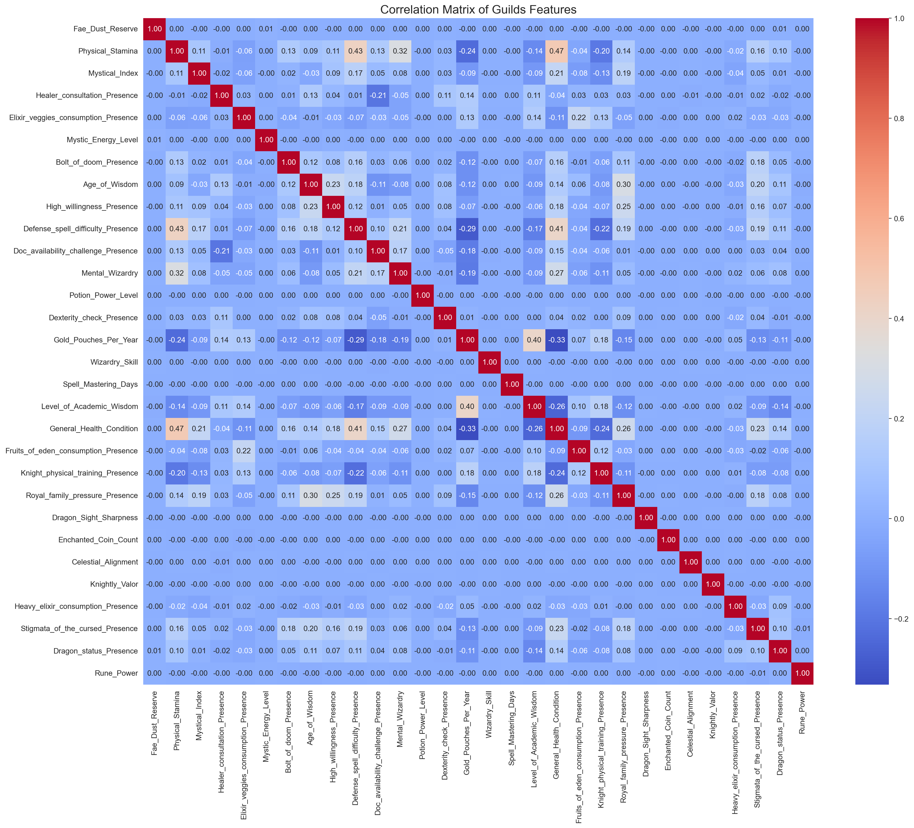
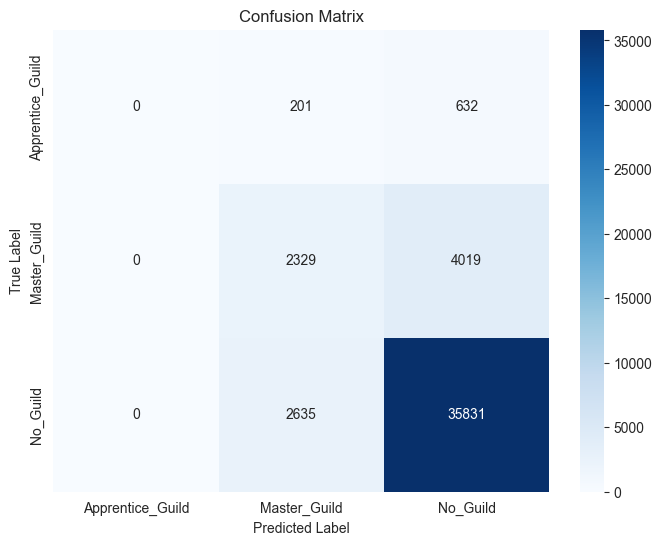
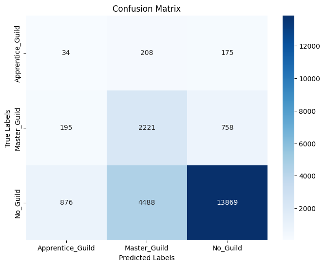

# Guilds Project

***Team Members:  Yanheng Li E04708; Yutong Lin; Luca Boccolieri.***

## 1.Introduction
This project aims to predict scholars' guild memberships based on multiple features. The dataset includes three guild classes: Apprentice_Guild, Master_Guild, and No_Guild, making it a multi-class classification problem. We employed a range of models from simple logistic regression to more complex Random Forest and Convolutional Neural Networks (CNN) and evaluated their performances.

## 2.Methods
For the task in the project, we are requested to build suitable models to anticipate the guild assignment for each scholar.  According to the dataset, we have 3 classes for guidls. In other word, this is a multiple classification problem. The methods used can be described as three parts respectively.

1. **Preprocessing and Exploratory Data Analysis (EDA)**:
   - Missing values in binary columns were imputed using the mode (most frequent value) of each column.
   - Missing numeric values were filled with the column mean to approximate the population mean, leveraging the law of large numbers for accuracy.
   - Observations with missing values in the dependent variable ("Guild_Membership") were dropped to avoid biasing the model.
   - Distributions and correlations in variables were shown to help understand data structure.

2. **Feature Engineering**:
   - Key feature importance was calculated using statistical techniques, e.g. the coefficients in regression function.
   - Data scaling and normalization were applied where necessary.

3. **Model Training and Evaluation**:
   - A classification model was trained using labeled data to predict "Guild_Membership" categories.
   - The Confusion Metrics including precision, recall, F1-score, and accuracy were calculated with the classification report for each moedel to evaluate performance.
   - A logitstic regression model was used as a baseline model to be compared. A random forest classifer and a CNN model were built to be considered. 

Our work could be sturctured as the workflow following:



The full environmental dependence was recorded in the "requirements.txt" and crated by the code following. (For sure, if you use different cuda version for torch, the dependence would be different). 
```python{.line-numbers}
pip install -r requirements.txt
```

## 3.Experimental Design
Our experimental design for the classification model was inplemented as data was well preprocessed. The design can be divided as three parts, incluing a baseline model and two complex models.

1. **Baseline: Logit Model**
   - Purpose: Build a baseline model for classifying guidls for sholars.
   - Why logit: It is the simplest and the most popular model in classfication, which totall fulls the requirements of the problem. 
   - Implementation: Here, we used multiple logistic regression (mlogit) because of multiple output classes. Having splitted the dataset into trainning and test set and prepocessed, we firstly selected the best features by forward selection, then trained and tested the model. All implementations are under the dependence of Sci-Kit Learn Package. 
   ```python{.line-numbers}
   from sklearn.linear_model import LogisticRegression
   ```

2. **Random Forest Classfier**
   - 	Purpose: Introduce a non-linear ensemble model for better performance.
	- Why Random Forest: It handles feature interactions and missing values well, providing robust results in multi-class problems.
	- Implementation: A Random Forest model was implemented using scikit-learn, with hyperparameter tuning to optimize the number of trees and depth.
   ```python{.line-numbers}
   from sklearn.model_selection import train_test_split, GridSearchCV
   from sklearn.ensemble import RandomForestClassifier
   ```

3. **Convolutional Neural Network**
   - Purpose: Build a complex model for achieving better model performance.
   - Why CNN: Firstly, it is expected that CNN will capture local dependencies and patterns between neighboring features, potentially improving performance. Secondly, the complex relationships in a large dataset may be better caputered by CNN.
   - Implementation: Following typical CNN process, we build a CNN model and trained by standardized training data. All implementations are under the dependence of PyTorch and CUDA hardwares.
   ```python{.line-numbers}
   import torch
   import torch.nn as nn
   import torch.optim as optim
   from torch.utils.data import DataLoader,TensorDataset
   ```
## 4.Results
### 4.1 **Exploratory Data Analysis**
Figures following show the distributions and relationships of all variables.




### 4,2 **Baseline: Logit Model**
The confusion matrix for the logit model is as follows:

|                | Predicted: Apprentice_Guild | Predicted: Master_Guild | Predicted: No_Guild |
|----------------|-----------------------------|--------------------------|---------------------|
| **True: Apprentice_Guild** | 129                         | 157                      | 131                 |
| **True: Master_Guild**     | 792                         | 1815                     | 567                 |
| **True: No_Guild**         | 3200                        | 3237                     | 12796               |

The performance of the logit model is summarized below:

| Class               | Precision | Recall | F1-Score | Support |
|---------------------|-----------|--------|----------|---------|
| Apprentice_Guild    | 0.03      | 0.31   | 0.06     | 417     |
| Master_Guild        | 0.35      | 0.57   | 0.43     | 3174    |
| No_Guild            | 0.95      | 0.67   | 0.78     | 19233   |
| **Accuracy**        |           |        | 0.65     | 22824   |
| **Macro Avg**       | 0.44      | 0.52   | 0.42     | 22824   |
| **Weighted Avg**    | 0.85      | 0.65   | 0.72     | 22824   |

- The logit model achieved an overall accuracy of **65%**.
- **No_Guild** class demonstrated the highest precision (0.95) and F1-score (0.78), indicating strong performance in identifying this class.
- The **Apprentice_Guild** class has notably low precision (0.03) and recall (0.31), suggesting challenges in detecting this category effectively.

### 4.3 **Random Forest Classfier**
The performance of the random forest classifier is summarized as below:

| Class               | Precision | Recall | F1-Score | Support |
|---------------------|-----------|--------|----------|---------|
| Apprentice_Guild    | 0.00      | 0.00   | 0.00     | 833     |
| Master_Guild        | 0.45      | 0.37   | 0.40     | 6348    |
| No_Guild            | 0.89      | 0.93   | 0.91     | 38466   |
| **Accuracy**        |           |        | 0.84     | 45647   |
| **Macro Avg**       | 0.45      | 0.43   | 0.44     | 45647   |
| **Weighted Avg**    | 0.81      | 0.84   | 0.82     | 45647   |
 - Accuracy: 84%
 - Best Performance: The **No_Guild** class with an F1-score of 0.91 and a precision of **89%**.
 - Weakness: The **Apprentice_Guild** class remains undetected with an F1-score of 0.00, indicating severe challenges in predicting minority classes.

### 4. **Convolutional Neural Network**
The confusion matrix for CNN is as follows:



The performance of CNN is summarized below:

| Class               | Precision | Recall | F1-Score | Support |
|---------------------|-----------|--------|----------|---------|
| Apprentice_Guild    | 0.03      | 0.08   | 0.04     | 417     |
| Master_Guild        | 0.32      | 0.70   | 0.44     | 3174    |
| No_Guild            | 0.94      | 0.72   | 0.81     | 19233   |
| **Accuracy**        |           |        | 0.71     | 22824   |
| **Macro Avg**       | 0.43      | 0.50   | 0.43     | 22824   |
| **Weighted Avg**    | 0.83      | 0.71   | 0.75     | 22824   |
- The CNN model achieved an overall accuracy of **71%**.
- The **No_Guild** class demonstrated the highest precision (0.94), recall (0.72), and F1-score (0.81), reflecting its dominant representation in the dataset.
- The **Master_Guild** class achieved moderate performance with an F1-score of **0.44**, indicating some predictive ability.
- The **Apprentice_Guild** class still struggled with the lowest F1-score of **0.04**, reflecting difficulty in detecting this class.

## 5.Conclusions
To sum up, here is an overview of our work:

Firstly, we performed data preprocessing and exploratory data analysis (EDA) to structure the dataset and uncover correlations between variables, ensuring it was ready for modeling.

Secondly, we applied Logistic Regression as a baseline model to set a standard for performance comparison.

Thirdly, given the limitations of the logistic regression model, we introduced more complex models, including a Random Forest Classifier and a Convolutional Neural Network (CNN) to improve predictive accuracy.

Finally, based on our results, the model selection was guided by the following considerations:
	1.	Model performance, including overall accuracy and F1-scores for each category.
	2.	Computational cost and training time required.
	3.	Model complexity and interpretability.
	4.	Context and purpose of the task.

The comparison among the models is summarized as follows:
	•	CNN demonstrated the best overall performance across all three guild categories, despite slightly lower accuracy compared to Random Forest.
	•	Training time varied significantly: Logistic Regression was the fastest (less than 8 minutes), followed by Random Forest (29 minutes), while CNN took nearly 1 hour using 8 GPUs.
	•	In terms of complexity, CNN is the most complex and least interpretable, whereas Logistic Regression is the simplest and most interpretable.

Given the purpose of the model—to assist the Academy in accurately predicting guild assignments—the model’s performance was prioritized over interpretability, and the computational cost was deemed manageable. Therefore, CNN was chosen as the most suitable model.

However, some challenges remain:
	•	The dataset is imbalanced, which affected all models. We initially applied oversampling, but the results were suboptimal. Adjusting class weights improved performance somewhat, but issues persisted.
	•	For Logistic Regression and Random Forest, identifying both Master_Guild and Apprentice_Guild was problematic.
	•	For CNN, predictions for Master_Guild were less accurate, though overall performance was better than the other models.

Despite our best efforts, we admitted that our models are not perfect. Addressing class imbalance and further refining model architectures remain crucial steps for future improvement.
